# **Lucene & Lire**
---
### Lucene(루씬)

 1. Lucene(루씬) 이란?
	  - 자바로 개발된 오픈소스 정보검색 라이브러리 (검색 애플리케이션이 아니다.)
	  - 아파치 재단의 오픈소스 프로젝트
	  - Full Text 의 색인 및 검색 기능
	  - 다운로드: https://lucene.apache.org/
      
 2.  Demo Example
		1. jar 파일 4개 Lucene 폴더에 복사
			- lucene-queryparser-8.7.0.jar
			- lucene-analyzers-common-8.7.0.jar
			- lucene-core-8.7.0.jar
			- lucene-demo-8.7.0.jar

		2. jar 압축 풀기 (4개 다)

			` jar xvf {파일명}.jar `

		    - ex) jar xvf lucene-demo-8.7.0.jar
		    - Lucene 폴더에 org, META-INF 폴더 생성됨
		    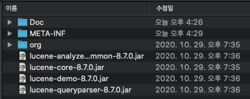

		3. 색인 할 txt file 을 Doc 파일에 생성
			- ex) NOTICE.txt, README.txt

		4.  Index 생성

			    java org.apache.lucene.demo.IndexFiles -docs Doc(색인할 문서가 있는 폴더)

			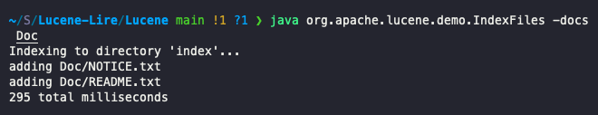
			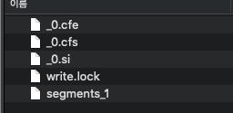

		5.  검색

			     ` java org.apache.lucene.demo.SearchFiles`

		    - 검색할 string 입력

				 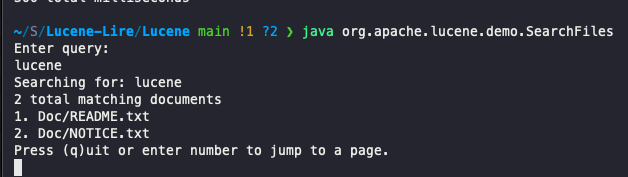

 3. Lucene의 Index, Search 살펴보기
	- Indexing 이란?

		문서 전체를 두고 검색을 하기위해서는 모든 문서를 대상으로 하나씩 단어나 구문을 찾아야한다. 문서의 양이 많아지고 한 문서의 크기가 커질수록 속도는 느려진다. 원문에서 단어를 추출하고 검색하기 좋은 형태의 문서로 만들어 리스트화 해두면 특정 단어의 위치로 바로 이동할 수 있다.
	
	- Indexing 과정
		* Lucene는 색인파일을 만들기 위해서 IndexWriter를 제공한다.
		1. 검색 대상 텍스트 확보
		2. 크롤러(crawler)가 색인할 대상 문서 수집
		3. 루씬 문서 생성
			- 원본문서를 루씬의 개별 문서 단위(document)로 변환
			- 텍스트를 추출하고 원하는 텍스트만 필터링하는 작업 필요
			- 루씬 문서는 여러 필드로 구성(제목, 본문, 저자, 링크 등)
		4. 문서 텍스트 분석
			- 토큰(token) 생성
			- 어떤 단위로 토큰 할 것인지 결정 필요
			- 동의어, 단수/복수형, 기본형, 대소문자 등의 이슈 처리
			- 루씬 프로젝트에는 다수의 텍스트 분석기 내장
		5. 색인에 문서 추가
			- 색인 과정이 끝난 문서를 색인에 추가

		

	- Searching
		1.	검색을 하기 위해서 색인 파일의 경로를 알아낸다.
		2.	이를 이용해서, IndexSearcher 생성. (인덱스 파일로부터 검색을 하기 위함)
		3.	Analyzer 사용해서 검색어(검색 키워드) 분석 
		4.	QueryParser 사용해서 루신에서 사용 가능한 쿼리로 변환
		5.	그렇게 나온 쿼리가 Query 클래스

---

* 참고: https://dogrushdev.tistory.com/135, https://devyongsik.tistory.com/335
			
 
 
---
### Lire(리레)

1. Lire(리레) 란?
	- Lucene Image Retrieval의 약자로 Lucene(루신) 기반의 이미지 검색 Java 라이브러리.
	- 색감 및 질감 특성을 기반으로 한 이미지와 사진을 검색
	- 다운로드: http://www.semanticmetadata.net/lire/

2. Lire Demo Test
	1. Lire Demo 다운로드
	2. Lire Demo 실행

		 ' java -jar liredemo.jar '

		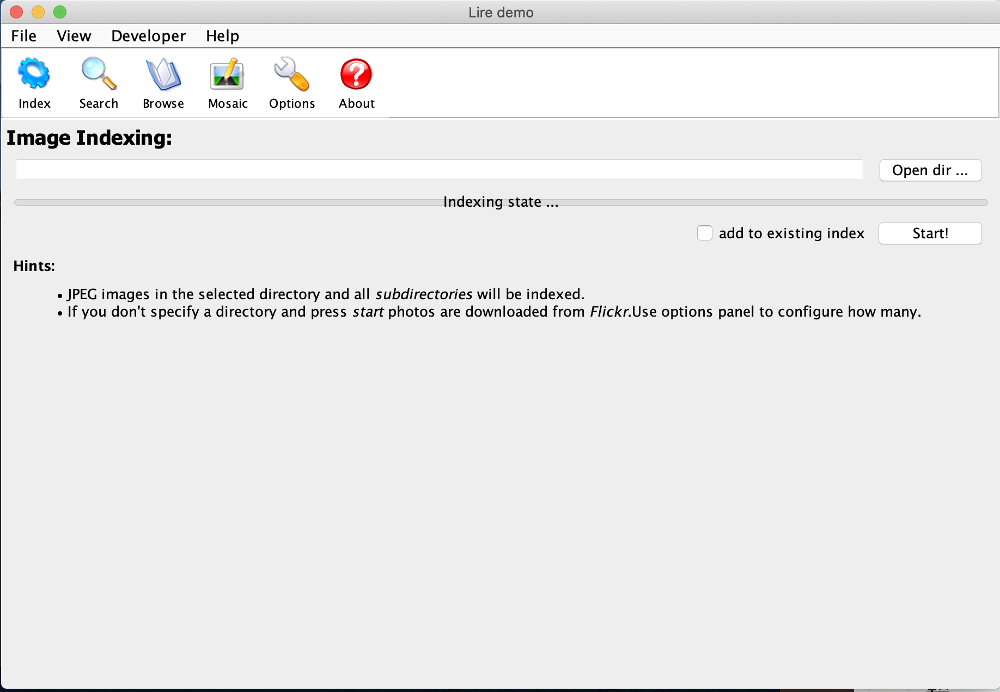

	3. Index 할 이미지 파일 선택
		- Open dir 선택
		- image 담겨있는 파일 선택
		- "add to exiting index" 체크
		- "Start" 

		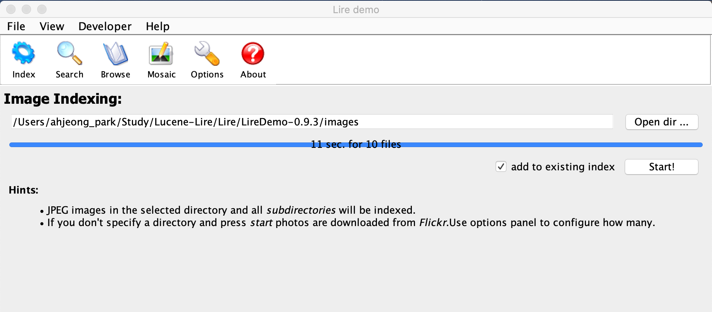
		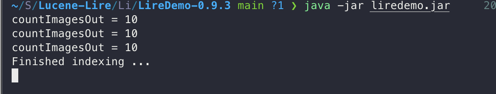
		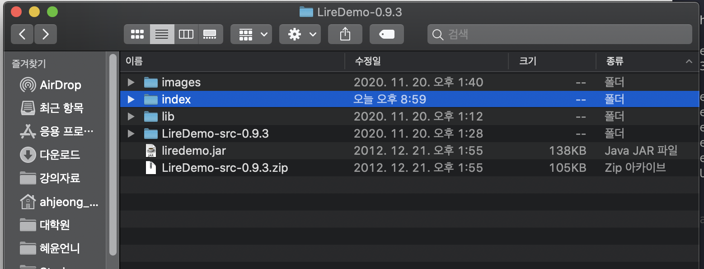
	
	4. 이미지 Search
		- 'Search' 선택
		- Open image 선택
		- img file 1개 선택
		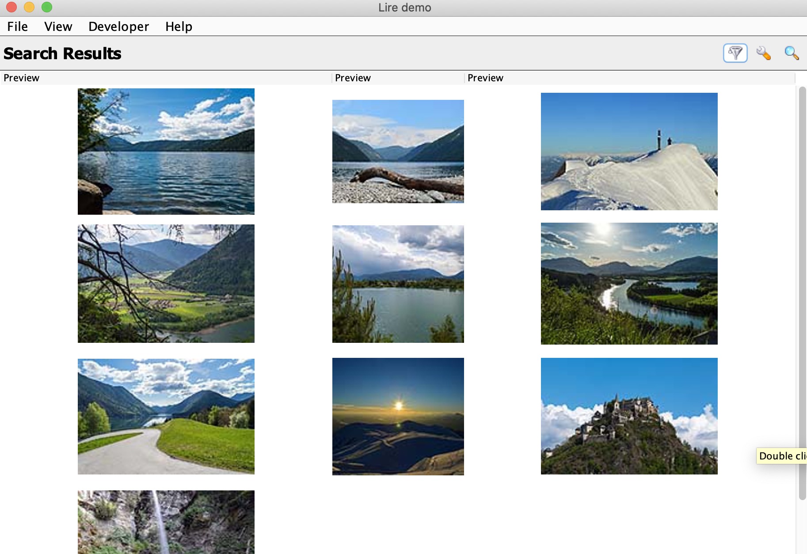
		
	* View 에서 IndexSearcher, Re-ranking feature 을 선택할 수 있다.
		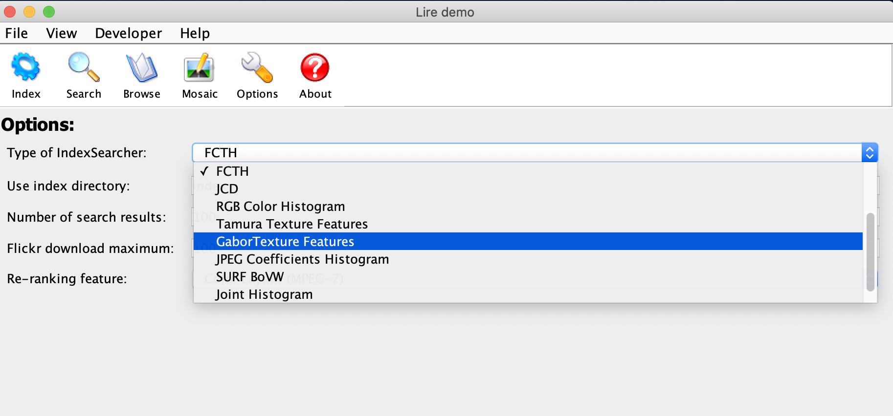
		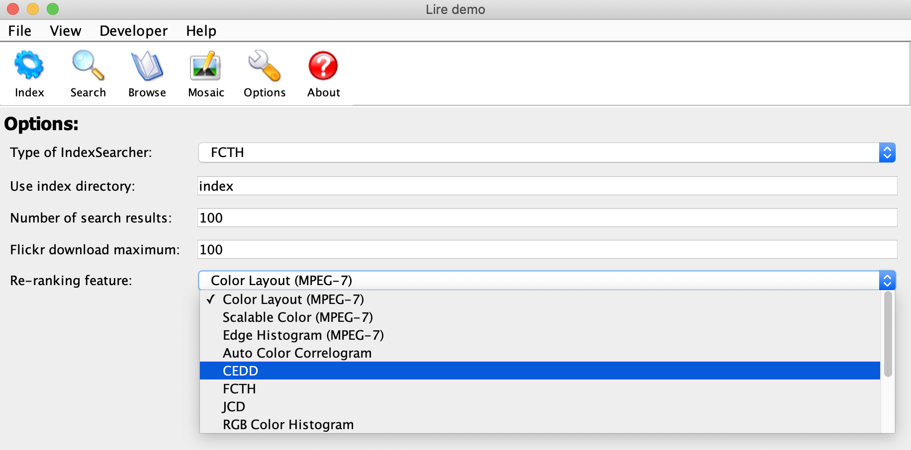

	* 참고
		https://github.com/Youngmi-Park/Lucene
		http://wittgena.blogspot.com/2011/07/lire-lucene-image-retrieval-library.html
		https://www.youtube.com/watch?v=hPpDU19UbPw
